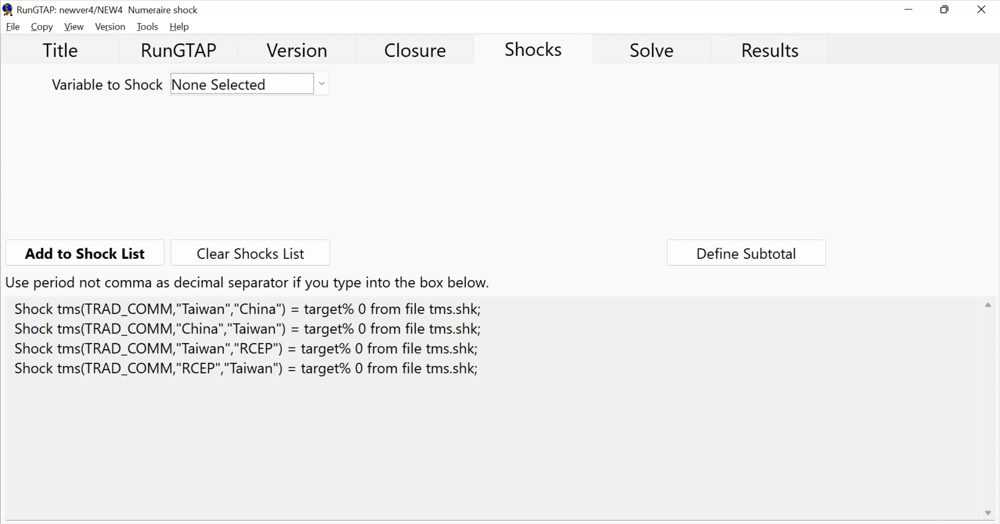
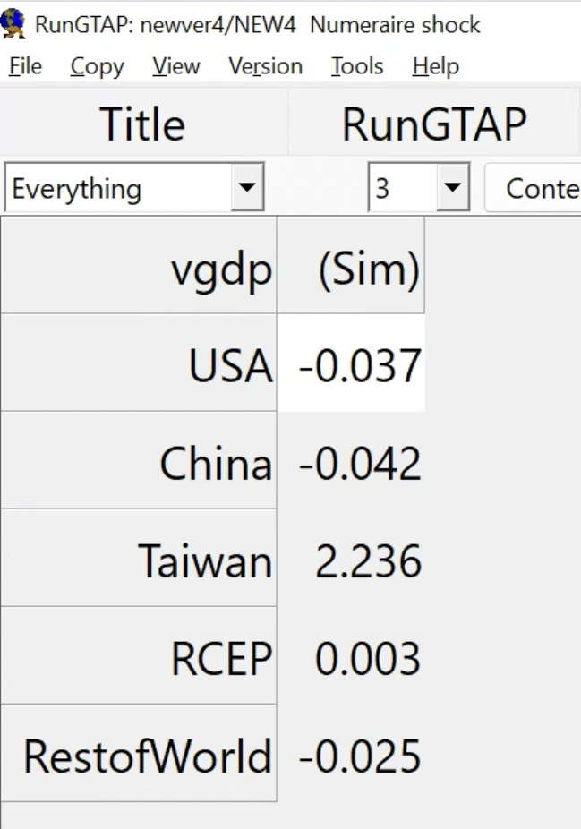
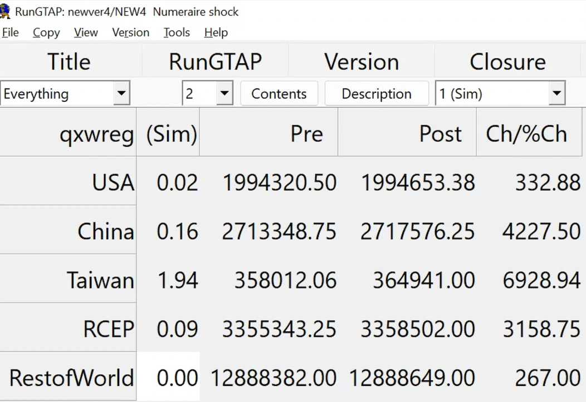
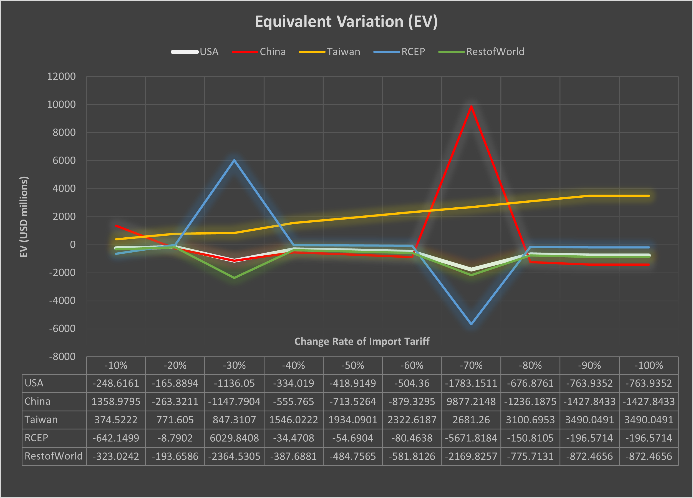

# Hello! 

- Academic
  - Ph.D. Candidate in Economics at [GW](https://gwu.edu)
  - Primary Field: International Trade 
  - Secondary Fields: Econometrics and Environmental Economics
  - Website: [https://jeffjkuo.github.io](https://jeffjkuo.github.io) ; Email: <jeffkuo@gwu.edu>

- Before GW
  - [Syracuse University](https://syr.edu) (M.A. Economics at Maxwell School, ’16)
  - [Institute of Economics, Academia Sinica](https://www.econ.sinica.edu.tw/) (Research Assistant, ’14)
  - R.O.C. Army (Army Officer, Second Lieutenant, ’13)
  - [National Chengchi University](https://nccu.edu.tw) (B.A + M.S. in International Trade, ’12)

- Personal
  - From the City of Kaohsiung: Southern Pride!
  - Generation of Sunflower Movement


---

# Outline
1.  Introduction

2.  Model and Data -> [Global Trade Analysis Project (GTAP)](https://www.gtap.agecon.purdue.edu/)

3.  Policy Shock

4.  Graphical Results

5.  Future Work

-   Note
    -   The full paper will be coming out soon. 
    -   Stay tune! <https://jeffjkuo.github.io/research>
    -   Question or comment, please email to [jeffkuo@gwu.edu](jeffkuo@gwu.edu)
    -   Scan to view today's slides 


```{r, echo=FALSE, out.width="20%", fig.align = 'center'}

```


---

# Introduction

-   Main Question
    
    -   If Taiwan joins [RCEP (Regional Comprehensive Economic Partnership)](https://rcepsec.org/), how does it affect China, the U.S., and the rest of world?

-   Relating Literature

    1.  Precarious Triangle (2000\~)
        -   [Murray Weidenbaum 2000. "United States-China-Taiwan: A Precarious Triangle." Challenge, Vol. 43, No. 5, pp. 92-106](https://www.jstor.org/stable/40722032)

    2.  China Syndrome (2010\~)
        -   [Autor, David H., David Dorn, and Gordon H. Hanson. 2013. "The China Syndrome: Local Labor Market Effects of Import Competition in the United States." American Economic Review, 103 (6): 2121-68.](https://www.aeaweb.org/articles?id=10.1257/aer.103.6.2121)
        

---

# Taiwan's Role?

1.   Taiwan's Role?
    -   If Taiwan joins RCEP, will the U.S. hurt? Will China benefit?
    
    -   If Taiwan is invited to join RCEP, should we discontinue ECFA?
    
2.   Contributions
    -   We single out Taiwan, China, and the U.S.
    
    -   Analyze the Preferential Trade Agreements that Taiwan got involved
---

# Data and Model: GTAP

-   Global Trade Analysis Project (GTAP)
    -   [GTAP Book (Thomas Hertel, 1997)](https://www.gtap.agecon.purdue.edu/products/gtap_book.asp)

    -   [GTAP Data Base](https://www.gtap.agecon.purdue.edu/databases/default.asp)

-   Data
    -   GTAP users upload each country's Input-Output (I-O) Tables

-   CGE Model
    -   General Equilibrium (Walrasian Equilibrium)
        -   Definition
        -   How supply and demand interact and tend toward a balance in an economy of multiple markets working at once.
        
    -   CGE: **C**omputational **G**eneral **E**quilibrium
        -  Using computers to solve GE
        -   We use the default model in the GTAP


---

# RunGTAP: A GUI for Controlling GTAP

{width="55%"}


---

# RunGTAP

RunGTAP is a simulator of the (trade) world.

```{r, echo=FALSE, out.width="80%", fig.align = 'center', fig.cap= 'Rehoboam (Westworld Season 3, HBO)'}

``` 

---

# RunGTAP Interface


---

# RunGTAP Setting

-   Regional Aggregation
```{r, echo=FALSE, out.width="80%", fig.align = 'center', fig.cap= 'GDP Growth Rate in Experimental Shocks'}
knitr::include_graphics("GTAPAggregation.png")
``` 

---
# GTAP Model Setting - Shock Experiment


---

# GTAP Model Simulation Results





---

# Result of Taiwan Joins RCEP - 1

```{r, echo=FALSE, out.width="80%", fig.align = 'center', fig.cap= 'Welfare Change in Experimental Shocks'}

``` 

---

# Result of Taiwan Joins RCEP - 2

-   Now we switch to $\Delta$GDP after the experimental shocks


```{r, echo=FALSE, out.width="80%", fig.align = 'center', fig.cap= 'GDP Growth Rate in Experimental Shocks'}

``` 

---

# Conclusion & Future Work & Thank You

-   Primary Conclusions

    1.   RCEP might be a good option for Taiwan.
    
    2.   Taiwan is blocked, not because of pure politcal reasons.
    
    3.   But if the U.S. was excluded, the U.S. will hurt the most.

-   Future Work
    -   Apply Heterogeneous Shocks in different production sectors.
    -   Explore more possible shocks in policy tools.
    -   Expand the analysis to see the synergy of multiple PTAs, i.e., CPTPP and EFCA.

-   Thank You!
    -   It's really nice to see you, and welcome to D.C.!
    -   Comments and questions, please send to [jeffkuo@gwu.edu](jeffkuo@gwu.edu)


