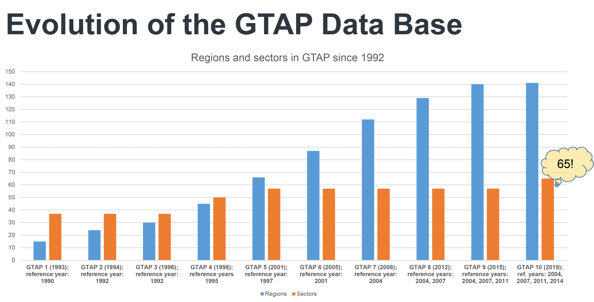
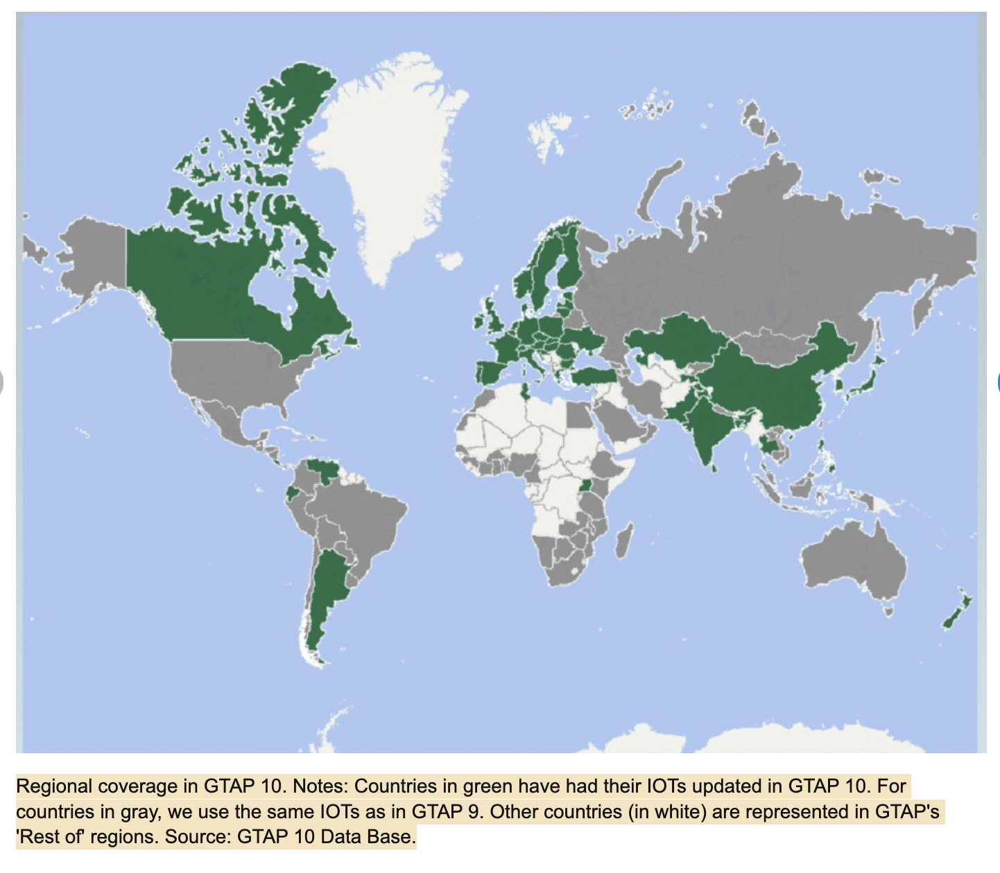
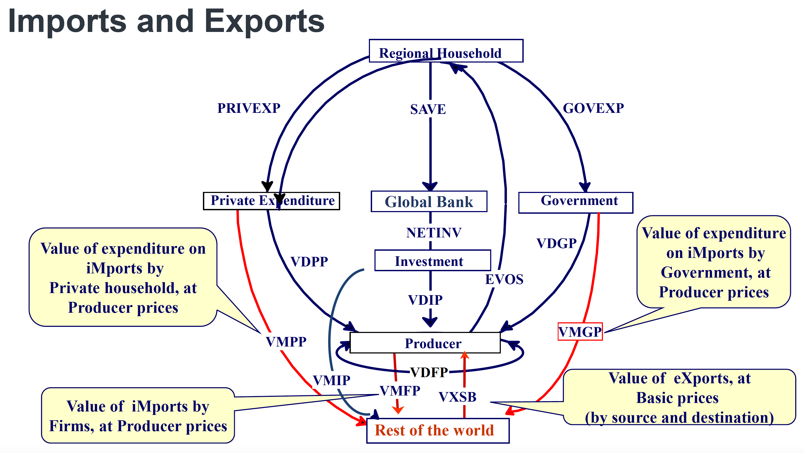
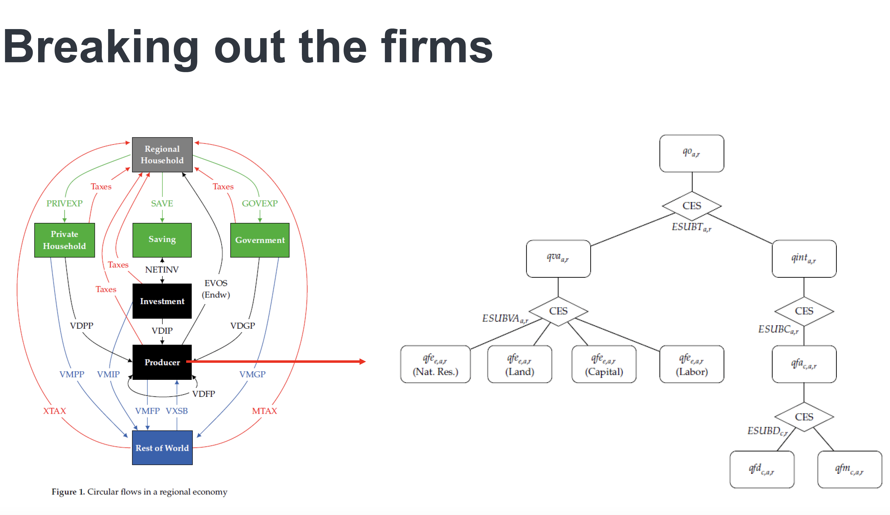
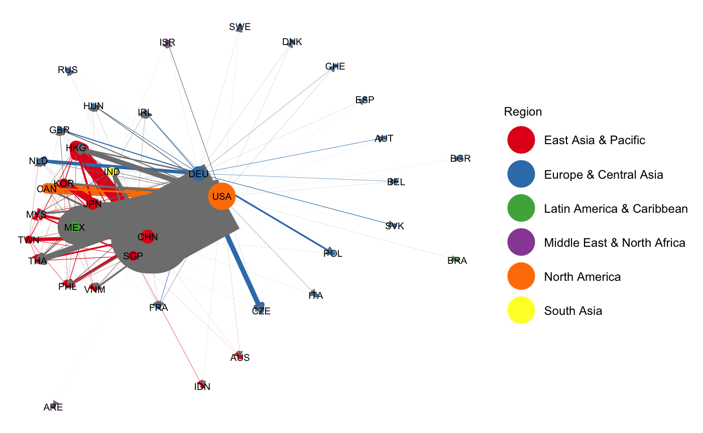

class: inverse, center, middle

# Hello! 

<!--
# About me
- Academic
  - Ph.D. Candidate in Economics at [GW](https://gwu.edu)
  
  - Primary Field: International Economics
  
  - Secondary Field: Applied Econometrics
  
  - Website: [https://jeffjkuo.github.io](https://jeffjkuo.github.io); Email: <jeffkuo@gwu.edu>

- Prior to GW

  - [Syracuse University](https://syr.edu) (M.A. Economics at Maxwell School, ’16)
  
  - [Institute of Economics, Academia Sinica](https://www.econ.sinica.edu.tw/) (Research Assistant, ’14)
  
  - R.O.C. Army (Reserved Military Officer, Second Lieutenant, ’13)
  
  - [National Chengchi University](https://nccu.edu.tw) (B.A + M.S. in International Trade, ’12)

- Personal
  - Hometown: Kaohsiung, Taiwan

--> 

---

# Roadmap of Today's Presentation

- Present three chapters of my dissertation.
  - All three chapters focused on the impact of Taiwan's trade policies.
  - Three different policy shocks: RCEP, WTO, and ECFA
  - Three different datasets: GTAP, UNComtrade, Taiwan CEC
  - Three different methodologies: CGE, Trade Network, RDD

- For today's presentation, you can

  - <u>**visit**</u> [HTML link](https://jeffjkuo.github.io/202304PRODEF/ProposalDefense_Kuo.html#1), or <u>**scan**</u> the QR code to view today's slides
```{r, echo=FALSE, out.width="15%", fig.align = 'center'}
  
```
  - <u>**access**</u> to the full dissertation proposal <https://jeffjkuo.github.io/proposal_0327.pdf>
  
  - <u>**find**</u> more about my work on my website -> <https://jeffjkuo.github.io>

---

class: inverse, center, middle

# Chapter 1: Simulation 
## Estimate RCEP's Cost of Placation Policy

---
class: inverse, center, middle

# Chapter 1 | Introduction

---

class: middle 

# Chapter 1 | Main Question

- For [Regional Comprehensive Economic Partnership (RCEP)]((https://rcepsec.org/),
  
  - How much does it cost for a **protective trade policy**?
  
  - i.e., What is the cost for RCEP to block out Taiwan?
  
    - Is **political compromise** costly for a trade bloc?

---

class: middle

# Chapter 1 | Policy Implication
  
- Estimate the cost of **lowering tension** trade policy, by
   
   - Adding shocks in CGE model 
   
   - Simulating the counter-factual outcome

- From a regional integration perspective,

  - How does *RCEP + Taiwan* affect U.S. and China? 
  
  - How would the rest of the world be affected?

---
class: middle

# Chapter 1 | Motivation

- Motivations are coming from three strings of **literature**

  1.  Political Economy 
        - [Murray Weidenbaum (2000). "United States-China-Taiwan: A Precarious Triangle." Challenge, Vol. 43, No. 5, pp. 92-106](https://www.jstor.org/stable/40722032)

  2. Trade 
        - [Autor, David H., David Dorn, and Gordon H. Hanson. (2013.) "The China Syndrome: Local Labor Market Effects of Import Competition in the United States." American Economic Review, 103 (6): 2121-68.](https://www.aeaweb.org/articles?id=10.1257/aer.103.6.2121)
        
  3. Computational General Equilibrium Model 
        - [Hertel, T. W. (1997). Global Trade Analysis: Modeling and Applications. United Kingdom: Cambridge University Press.](https://scholar.google.com/citations?view_op=view_citation&hl=en&user=DulicT8AAAAJ&citation_for_view=DulicT8AAAAJ:u5HHmVD_uO8C)
---

# Chapter 1 | Conceptual Framework

**Fact 1** 

<div style="background-color: #cfc ; padding: 10px; border: 1px solid green; text-align: center"> Taiwan has been eager and willing to join RCEP </div>
  
- [New Southbound Policy (2018)](https://www.csis.org/programs/china-power-project/taiwan/new-southbound-policy)  
  
**Fact 2**

<div style="background-color: #cfc ; padding: 10px; border: 1px solid green; text-align: center"> China blockades Taiwan's role in international community </div>

- [Why Does the WHO Exclude Taiwan? (2020)](https://www.cfr.org/in-brief/why-does-who-exclude-taiwan)  

**Assumption**

<div style="background-color: #cfc ; padding: 10px; border: 1px solid green; text-align: center"> Taiwan's exlcusion to RCEP is due to China's interference</div>

-  [Taiwan, Frozen Out of RCEP, Explores Trade Agreement Options With US (2020)](https://thediplomat.com/2020/11/taiwan-frozen-out-of-rcep-explores-trade-agreement-options-with-us/)  

---

class: inverse, left, middle

## Contributions

1. Define a term and estimate the **cost** of <span style='font-size:pt; color:pink'>**political compromise**</span>
  <!--- We estimate the <span style='font-size:pt; color:pink'>**opportunity cost**</span> of excluding Taiwan

  - The result can potentially apply to another case in the world --> 

2. Re-evaluate Taiwan's role in US-China geopolitical competition

  <!-- - If Taiwan joins RCEP, will the RCEP, US, or China benefit or hurt? --> 
  
3. The welfare change for the *RCEP+Taiwan* were <span style='font-size:pt; color:pink'>**non-linear**</span>

<!--along with the magnitude of liberalization--> 
 
---
class: left, middle

## Regional Comprehensive Economic Partnership (RCEP) 

- The 15 members of the RCEP agreement
  - Australia, Brunei, Cambodia, China, Indonesia, Japan, South Korea, Laos, Malaysia, Myanmar, New Zealand, the Philippines, Singapore, Thailand, and Vietnam.
  
```{r, echo=FALSE,  eval = TRUE, out.width="50%", fig.align = 'center', fig.cap= ' Sources: World Bank; UN Comtrade, Gaulier and Zignago (2010) illustration.'}
knitr::include_graphics("rcep.png")
```


<!-- --- -->

<!-- # Model  -->
<!-- GTAP Overview - Production - Consumption - Price - Open Economy -->

---

## Methodology - GTAP Simulation

-   Global Trade Analysis Project (GTAP)
    -   [GTAP Book (Thomas Hertel, 1997)](https://www.gtap.agecon.purdue.edu/products/gtap_book.asp)

    -   [GTAP Data Base](https://www.gtap.agecon.purdue.edu/databases/default.asp)

-   Data
    -   GTAP 10 Databse (2019 release) 

    -   Updated by the GTAP users 

    -   Constructed by each country's Input-Output (I-O) Tables

-   Model 
    - [The Standard GTAP Model, Version 7](https://jgea.org/ojs/index.php/jgea/article/view/47)
    
    - Multiple markets (sectors x regions x factor) working at once
    
    - Using computers to solve high-dimensional GE model
    

---

# GTAP System

{width=100%}


---

# Data - GTAP Database Version 10


- Version 10 was released in 2018 by Center for Global Trade Analysis
- In GTAP 10 
  - Sector, N = 65, Country, N = 141, Production Factors, N = 5
  - So we basically solving a 65 x 141 x 5 model everytime

---

## Regional Coverage
<center>
```{r pressure, echo=FALSE, out.width = '75%', align='center'}

```
</center>
(Augiar et al, 2019) [DOI:10.21642/JGEA.040101AF](DOI:10.21642/JGEA.040101AF)

<!--
---

## Circular Flow Model


---

# Open Economy 

--->
---

# Parameters

- Parameters in GTAP model


---




---

# CES Nested Production

A 'firm' is a series of CES production functions

  - Top level

    - optimally (min cost) combine value added and intermediate aggregate

  - 2nd level

    - Value added nest: Optimally (min cost) combine value-added inputs

    - Intermediate nest: Optimally (min cost) combine intermediate inputs


---

# Production in GEMPACK Code 


---

# Consumption in GEMPACK Code 


---

## Simulation - RunGTAP

- A GUI for controlling GTAP experiments

- RunGTAP Interface


---

# RunGTAP Setting

- Regional Aggregation
```{r, echo=FALSE, out.width="80%", fig.align = 'center', fig.cap= 'GDP Growth Rate in Experimental Shocks'}
knitr::include_graphics("GTAPAggregation.png")
``` 

---

# Shock Experiment


---

class: center, middle  

# Simulation Result Clips


---

# Chapter 1 | Result - 1

- First we tablet to EV after the experimental shocks

```{r, echo=FALSE, out.width="80%", fig.align = 'center', fig.cap= 'Welfare Change in Experimental Shocks'}
knitr::include_graphics("EVchange.png")
``` 

---

# Chapter 2 | Result - 2

- Then we switch to $\Delta$GDP after the experimental shocks

```{r, echo=FALSE, out.width="80%", fig.align = 'center', fig.cap= 'GDP Growth Rate in Experimental Shocks'}
knitr::include_graphics("GDPchange.png")
``` 


---

# Chapter 1 | Conclusion

1. Define a _new term_, **placating cost**, and estimate it.
  - It's costly to lower the tension.
  - We focus on the case of Taiwan-RCEP case
  - We apply the widely-used Computational GE Model
  - We apply the updated dataset with lastest sector-level I-O tables 
    
3. Show RCEP is a _good option_ for Taiwan.
  -  It's cliché, but we show quantitative estimation here 
  - **limitation** (banned goods across the straights)

4. Provide _anothor explanation_ of current equilibrium
  - Taiwan's exclusion is not due to pure politics.
  - Economic benefits skew to Taiwan asymmetrically.
  - Neither due to pure economics, nor pure politics.

---
class: middle, center, inverse

# Chapter 2: Trade Network og Global IT Industry 
## Does Trade Liberalization Affect Taiwan's Role in Exporting Computers?

---
class: inverse, middle, center
# Chapter 2 Introduction

---

# Chapter 2  

## Main Questions

- Does the Trade Liberalization (China and Taiwan both joins WTO) change the computer industry globally? 

- What is the evolution of the trade network between Taiwan, China, and the U.S.?

---
# Chapter 2 | Literature

## Network Theory
- Jackson, M.O.: The human network : How your social position determines your power,
beliefs, and behaviors. Pantheon Books, New York (2019)

- Jackson, M.O., Rodriguez-Barraquer, T., Tan, X.: Social capital and social quilts: Network patterns of favor exchange. American Economic Review. 102, 1857–97 (2012). https://doi.org/10.1257/aer.102.5.1857

- Jackson, M.O., Rogers, B., Zenou, Y.: Networks: An economic perspective. Oxford Handbook of Social Network Analysis, Oxford, Oxford University Press (2016)

## International Trade Network
- Smith, M.: ITNr: Analysis of the international trade network. (2023)

---

# Chapter 2 | Data
- UN Comtrade
<center>
```{r, echo=FALSE, out.width="50%", fig.cap="UN Comtrade Database"}
knitr::include_graphics("UNcomtrade.png")
```
</center>
- WITS: World Integrated Trade Solution

- We use the API program in R to extract the data

- Taiwan is not included in the database as a "country." Specifically, we have to find region code "nes, Asia."

---

# Methodology

1. Our first step was to call out all the packages we need in R and start searching for product codes. We put this key word into the “comtradr” package in R to search for computer-related products.

2. Download the data from the UNComtrade and WITS.

3. Make a plot by the ITNr function. 

  - This provides a single network plot, where it requires you to specify whether the nodes should be colored by region and whether labels should be present.

  - If the nodes are colored by region, the ties between countries in the same region (intra-regional) are the same color as the node, and all other ties (inter-regional) are grey.

  - Node size is based on weighted out degree centrality - so reflects export performance. The edge size is based on the weights of the ties.

---

# Chapter 2 | Results

- We plot out the network graph of exporting the computer-related goods.
- In different years, 1996, 2000, 2004, 2008, 2012, 2016, 2020 

- 1996 v.s. 2016 "PC Relating Products Export Network"
<figure>


</figure>

---

# Chapter 2 Conclusions

**Main Findings**

1. The degree of the centrality of Taiwan's computer exporting decrease as time passed. 

2. China's degree of centrality moves toward to the center of network. And the replacement of the Taiwan's position came after 2000, the year China joins WTO.

3. US has been central to PC exporting across the sample periods.

---
class: center, inverse, middle
# Chapter 3: Importing Sentiment 
## How Does ECFA Realign Political Ideology?

---
# Overview of Chapter 3

  + "Election before and after ECFA"
    + Question 1: "Do ECFA's open border policies reduce the tension?"
    + Question 2: "How does the city-country side's ideological change?"
    + Question 3: "Does this violate the "progressive integration theory?"
  
  + Preview of results
    + Answer 1: No
    + Answer 2: Yes
    + Answer 3: Yes
    
  + Contributions
    + New dataset: Election Results + GIS
    + RD models: Different local polynomial
    + Counter-example of B. Belassa's Integration Theory
---

# Presidential Elections: Pre- v.s. Post- ECFA 
<figure>


</figure>

  + Pattern? Which regions switch their party the most?
  
---

# Chapter 3 | Policy Shock 

<figure>

</figure>

  + Economic Cooperation Framework Agreement (ECFA) 
  + Chinese Visitors to Taiwan 

---

# Chapter 3 | Data Sources 


---

# Chapter 3 | Identification

  + Methodology: Sharp Regression Discontinuity Design
    - cutoff (c): driving distance of 2.5 hours
    - This cutoff is the line between exposed to tourists or not
    
  + Identification 
    - Sharp RD Design [Lee (2008); Lee and Lemieux (2010) 

$$  Y_{i} = D_i\tau + W_i \delta_1 + U_i \tag{RD1} $$
$$ D_i = 1[X_i \ge c] \tag{RD2} $$
$$ X_i = W_i\delta_2 + V_i \tag{RD3} $$

  - Variables
    - $Y_i$ : Outcome variables. K-D Margin, K%-D% 
    - $D_i$ : Treatment. The district is exposed to tourists or not. 
    - $X_i$ : Assigning variable. The travel time to TPE airport.
    - $W_i$ : Unobserved endogenous variable. The real tourist numbers; which is assumed to have the effect on the result of election $Y_i$. 
    - According to tourist trade literature that distance negatively correlates with the number of tourists, so that $\delta_2$ $\neq 0$. 

---

# Chapter 3 | Result: RD Graphs

```{r, echo=FALSE,out.width="49%", out.height="50%",fig.cap="Different local polynomial assumptions",fig.show='hold',fig.align='center'}
knitr::include_graphics(c("16linear.png","16quadratic.png","16cubic.png","16quartic.png"))
``` 
---

# Chapter 3 | Algorithm

  1.  Calculate the distance between the municipalities and the tourists attractions.
  
  2.  Calculate the mean of distances, set the municipalities into control and treatment group.
  
  3.  Set the mean of the distance as the cutoff to the close and away regions.
    
  4.  Run the regression discontinuity using the (2004), 2008, (2012), 2016 presidential electoral data.
  
  5.  Compare the treatment effects at the cutoff. (under and over exposed tourists regions)

---

# Thank You!
  - Comments and questions, please email to [jeffkuo@gwu.edu](jeffkuo@gwu.edu)

  - Thank you for your time.

<center>

```{r, echo=FALSE, out.width="50%", fig.cap="Georgetown Waterfront"}
knitr::include_graphics("./dcpicture/waterfront.jpg")
```
</center>

