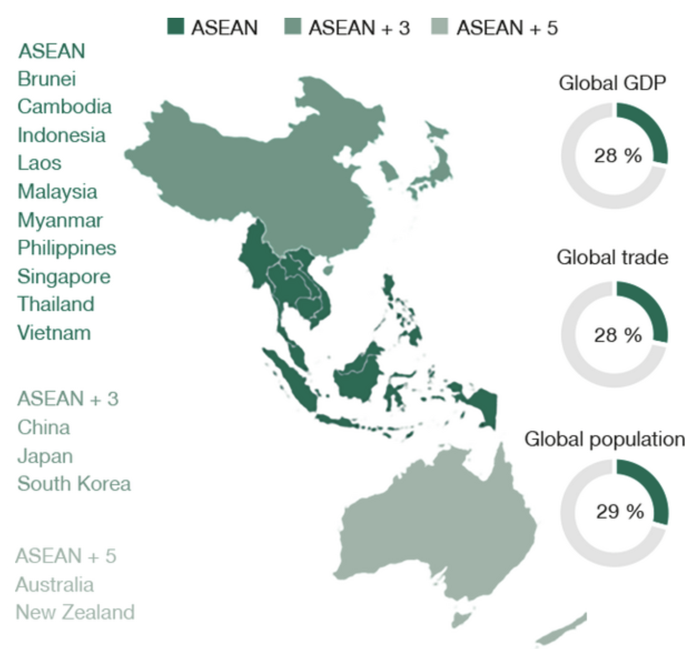
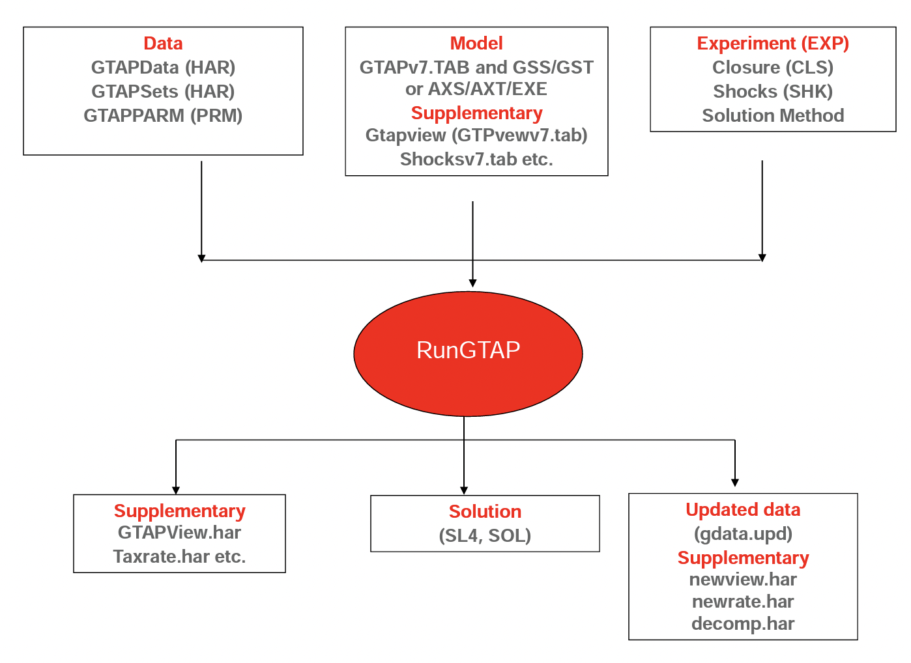
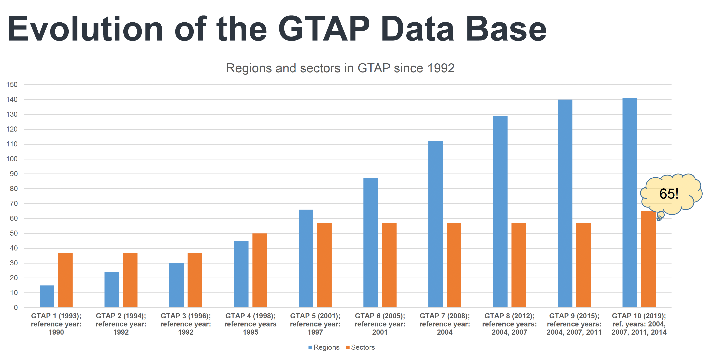
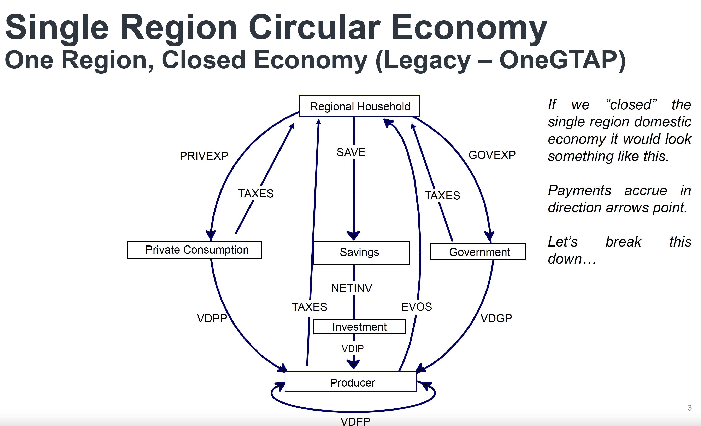
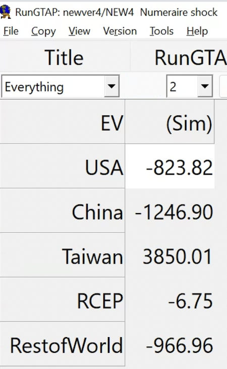
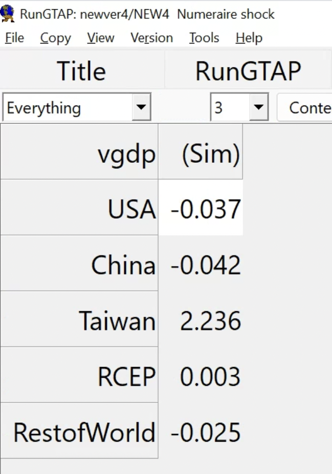
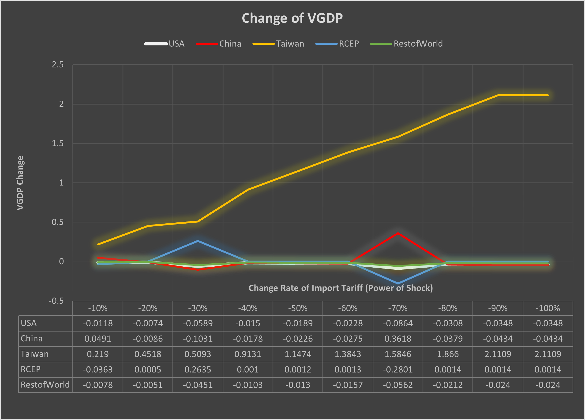

class: inverse, center, middle

# Hello! 

<!--
# About me
- Academic
  - Ph.D. Candidate in Economics at [GW](https://gwu.edu)
  
  - Primary Field: International Economics
  
  - Secondary Field: Applied Econometrics
  
  - Website: [https://jeffjkuo.github.io](https://jeffjkuo.github.io); Email: <jeffkuo@gwu.edu>

- Prior to GW

  - [Syracuse University](https://syr.edu) (M.A. Economics at Maxwell School, ’16)
  
  - [Institute of Economics, Academia Sinica](https://www.econ.sinica.edu.tw/) (Research Assistant, ’14)
  
  - R.O.C. Army (Reserved Military Officer, Second Lieutenant, ’13)
  
  - [National Chengchi University](https://nccu.edu.tw) (B.A + M.S. in International Trade, ’12)

- Personal
  - Hometown: Kaohsiung, Taiwan

--> 

---

# Today's Presentations

You can 

- <u>**visit**</u> [https://jeffjkuo.github.io/2023CESNA/CESNA_KUO_Slides.html#1](jeffjkuo.github.io/2023NSYSU/NSYSU_KUO_Slides.html#1)

- <u>**scan**</u> to view today's slides
    
```{r, echo=FALSE, out.width="30%", fig.align = 'center'}

```
    
- <u>**access**</u> to the full paper -> <https://jeffjkuo.github.io/CGE1> (still updating)

- <u>**find**</u> more about my work on my website -> <https://jeffjkuo.github.io>
  
- <u>**email**</u> to [jeffkuo@gwu.edu](jeffkuo@gwu.edu), for more questions and comments


---

class: inverse, center, middle

# Introduction

---

class:middle 

# Main Question

- For a trade bloc like RCEP,
  - How much does it cost for a **protective trade policy**?
  - i.e., blocking out a strong economic entity

- Policy Implication: 
  - Is **political compromise** costly for the trade bloc?

- From Taiwan's perspective,
  - How does [RCEP](https://rcepsec.org/)+Taiwan affect U.S.-China **co-opetition**? 
  - How would the rest of the world be affected?

---
class: middle

# Motivation

- Motivations are coming from two strings of **literature**...

  1.  Precarious Triangle (2000)
        -   [Murray Weidenbaum 2000. "United States-China-Taiwan: A Precarious Triangle." Challenge, Vol. 43, No. 5, pp. 92-106](https://www.jstor.org/stable/40722032)

  2. China Syndrome (2010)
        -   [Autor, David H., David Dorn, and Gordon H. Hanson. 2013. "The China Syndrome: Local Labor Market Effects of Import Competition in the United States." American Economic Review, 103 (6): 2121-68.](https://www.aeaweb.org/articles?id=10.1257/aer.103.6.2121)
        
- How about connecting those two topics with the CGE model?      
  - 1 + 2 + CGE 

---

# Assumption

**Assumption 1** 

<div style="background-color: #cfc ; padding: 10px; border: 1px solid green; text-align: center"> Taiwan has been eager and willing to join RCEP </div>
  
- [New Southbound Policy (_CSIS China Power Project Report_, 2018)](https://www.csis.org/programs/china-power-project/taiwan/new-southbound-policy)  
  
**Assumption 2**

<div style="background-color: #cfc ; padding: 10px; border: 1px solid green; text-align: center"> China blockades Taiwan's role in international community </div>

- [Why Does the WHO Exclude Taiwan? (_Council on Foreign Relations_, 2020)](https://www.cfr.org/in-brief/why-does-who-exclude-taiwan)  

**Assumption 3**

<div style="background-color: #cfc ; padding: 10px; border: 1px solid green; text-align: center"> Taiwan's exlcusion to RCEP is due to China's interference</div>

-  [Taiwan, Frozen Out of RCEP, Explores Trade Agreement Options With US (_The Diplomat_, 2020)](https://thediplomat.com/2020/11/taiwan-frozen-out-of-rcep-explores-trade-agreement-options-with-us/)  

---

class: inverse, left, middle

## Contribution

1. Define a term and estimate the **cost** of <span style='font-size:pt; color:pink'>**political compromise**</span>
  - We estimate the <span style='font-size:pt; color:pink'>**opportunity cost**</span> of excluding Taiwan

  - The result can potentially apply to another case in the world

2. Re-evaluate Taiwan's role in US-China geopolitical competition

  - If Taiwan joins RCEP, will the RCEP, US, or China benefit or hurt?
  
3. The benefit and the loss for the counterparts involved were 
  - <span style='font-size:pt; color:pink'>**non-linear**</span>, along with the magnitude of liberalization
 
---
class: left, middle

# RCEP 
- Regional Comprehensive Economic Partnership
- The 15 members of the RCEP agreement

```{r, echo=FALSE,  eval = TRUE, out.width="50%", fig.align = 'center', fig.cap= ' Sources: World Bank; UN Comtrade, Gaulier and Zignago (2010) illustration.'}

```


<!-- --- -->

<!-- # Model  -->
<!-- GTAP Overview - Production - Consumption - Price - Open Economy -->

---

## Main Methodology - GTAP Simulation

-   Global Trade Analysis Project (GTAP)
    -   [GTAP Book (Thomas Hertel, 1997)](https://www.gtap.agecon.purdue.edu/products/gtap_book.asp)

    -   [GTAP Data Base](https://www.gtap.agecon.purdue.edu/databases/default.asp)

-   Data
    -   GTAP users upload each country's Input-Output (I-O) Tables

-   CGE = **C**omputational **G**eneral **E**quilibrium
    - How supply and demand strike a balance in an economy 
    
    - Multiple markets (sectors x regions x factor) working at once
    
    - Using computers to solve high-dimensional GE model
    
    - We use the default model in the GTAP

---

# GTAP System

{width=100%}


---

# Data - GTAP Database Version 10


- Version 10 was released in 2018 by Center for Global Trade Analysis
- In GTAP 10 
  - Sector, N = 65, Country, N = 141, Production Factors, N = 5
  - So we basically solving a 65 x 141 x 5 model everytime

---

# Data - Snapshot of the Database


---


## Regional Coverage
<center>
```{r pressure, echo=FALSE, out.width = '75%', align='center'}
knitr::include_graphics("gtapdb2.png")
```
</center>
(Augiar et al, 2019) [DOI:10.21642/JGEA.040101AF](DOI:10.21642/JGEA.040101AF)


---

## Model in a nutshell


---

# Open Economy 

---

## Simulation - RunGTAP

- A GUI for controlling GTAP experiments

- RunGTAP Interface


---

# RunGTAP Setting

- Regional Aggregation
```{r, echo=FALSE, out.width="80%", fig.align = 'center', fig.cap= 'GDP Growth Rate in Experimental Shocks'}
knitr::include_graphics("GTAPAggregation.png")
``` 

---

# Shock Experiment


<!-- --- -->
<!-- class: inverse, center, middle  -->

<!-- # Simulation Result -->

<!-- --- -->

<!-- class: center, middle  -->

<!-- # Simulation Result Clips -->

<!--  -->
<!--  -->
<!--  -->

<!-- --- -->

---

# Result of Taiwan Joins RCEP - 1

- First we tablet to EV after the experimental shocks

```{r, echo=FALSE, out.width="80%", fig.align = 'center', fig.cap= 'Welfare Change in Experimental Shocks'}
knitr::include_graphics("EVchange.png")
``` 

---

# Result of Taiwan Joins RCEP - 2

- Then we switch to $\Delta$GDP after the experimental shocks

```{r, echo=FALSE, out.width="80%", fig.align = 'center', fig.cap= 'GDP Growth Rate in Experimental Shocks'}

``` 


---

# Conclusion

1. Define a _new term_, **placating cost**, and estimate it 
  - We focus on the case of Taiwan-RCEP-China case
  - We apply the widely-used Computational GE Model
  - We apply the updated dataset with lastest sector-level I-O tables 
    
3. Show RCEP is a _good option_ for Taiwan.
  -  It's cliché, but we show quantitative estimation here 
  - **limitation** (banned goods across the straights)

4. Provide _anothor explanation_ of current equilibrium
  - Taiwan's exclusion is not due to pure politics
  - Economic benefits skew to Taiwan asymmetrically 
  - Neither due to pure economics (this is still hard to prove it) 

---

class: middle, left
# Future Work

1. Apply **heterogeneous shocks** to different production sectors 

  - Cross reference to the updated tariff reduction schedule
    
2. Explore more possible shocks in trade. 
  
  - i.e., like **blockade** or military drills
  
  - This is on the horizon with Anton Yang.
    
3. Expand the analysis to exam future PTAs, or review the exisiting one. 

  - i.e., CPTPP, U.S.-Taiwan Initiative on 21st-Century Trade.
    
---

# Other Research Projects 

- $N = 5$ 

  - **CGE2**, with Anton Yang (Yale)
      - Blockade of China
      
  - **CGE3**, with Paul W. Chang (Northeastern) 
      - Same topic, on the financial sector
      
  - **TPDL**, Trade Policy Deep Learning, with Jialu Ma (Temple, Fox Business School)
      - Gorodnichenko, Yuriy, Tho Pham, and Oleksandr Talavera. 2023. "The Voice of Monetary Policy." American Economic Review, 113 (2): 548-84. DOI: [10.1257/aer.20220129](https://www.aeaweb.org/articles?id=10.1257/aer.20220129)
      
  - **ITN**, International Trade Network (Ch. 2 of dissertation)
      - [Chaney, 2016](https://academic.oup.com/edited-volume/28058/chapter-abstract/212027713?redirectedFrom=fulltext)
      
  - **DBE**, New Patterns of Taiwan's Elections (Ch.3 of dissertation)
  

---

# Thank You!
  - Comments and questions, please email to [jeffkuo@gwu.edu](jeffkuo@gwu.edu)

  - It's really nice to see you, please let me know if you stop by D.C.

<center>

 ```{r, echo=FALSE, out.width="50%", fig.cap="Georgetown Waterfront (pc:me) "}

```
</center>

