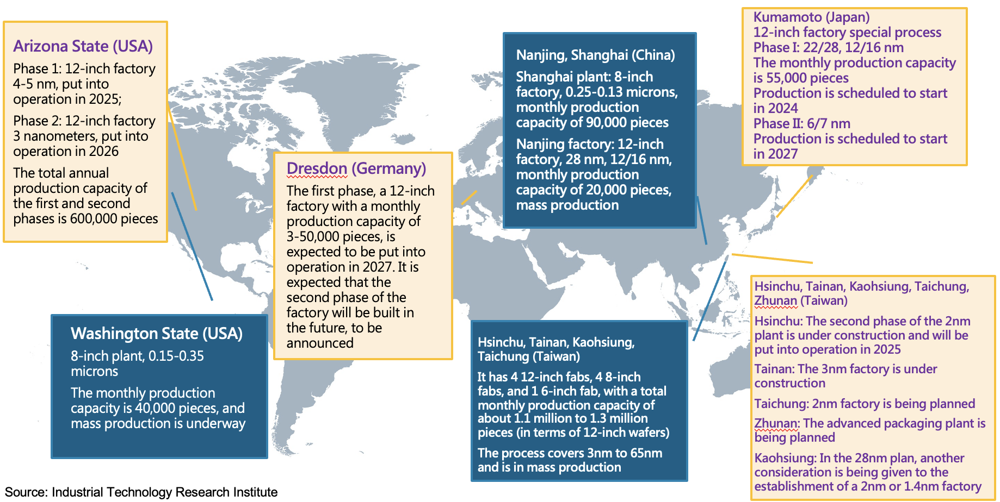
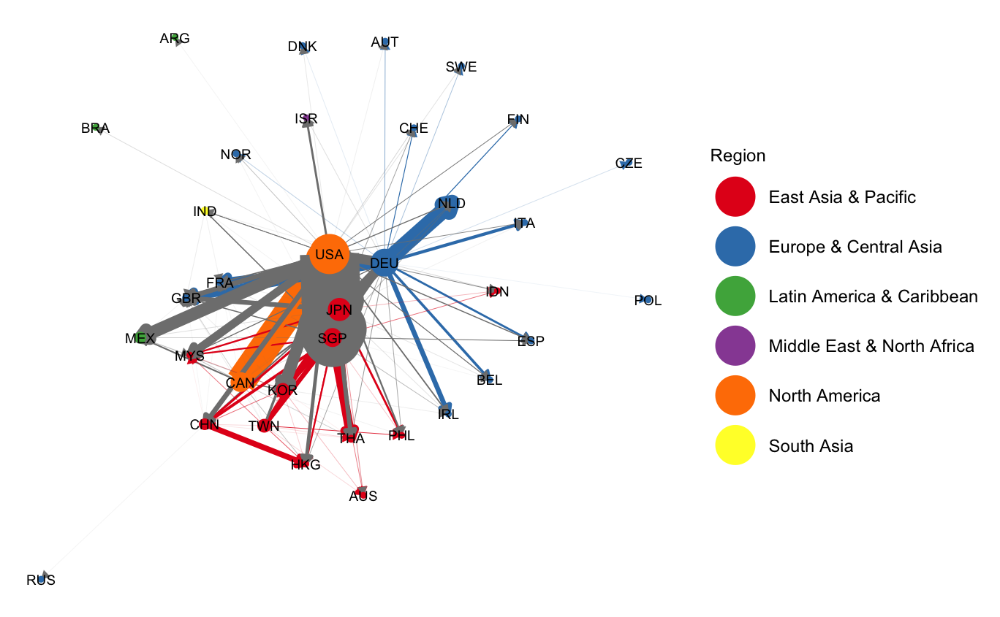
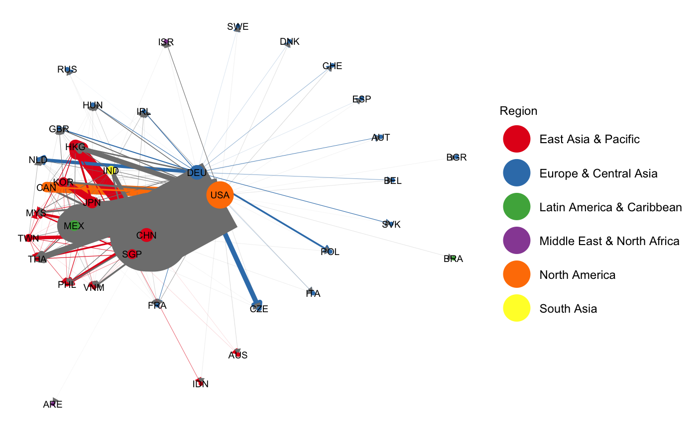
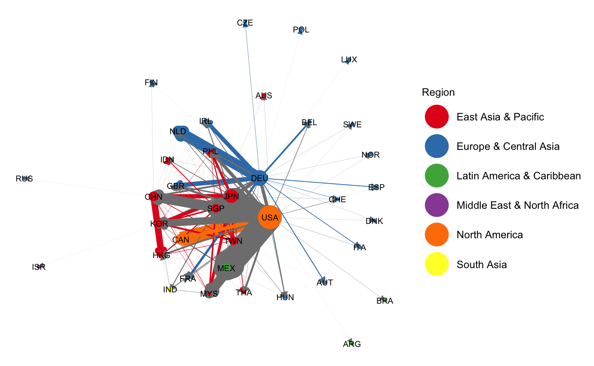
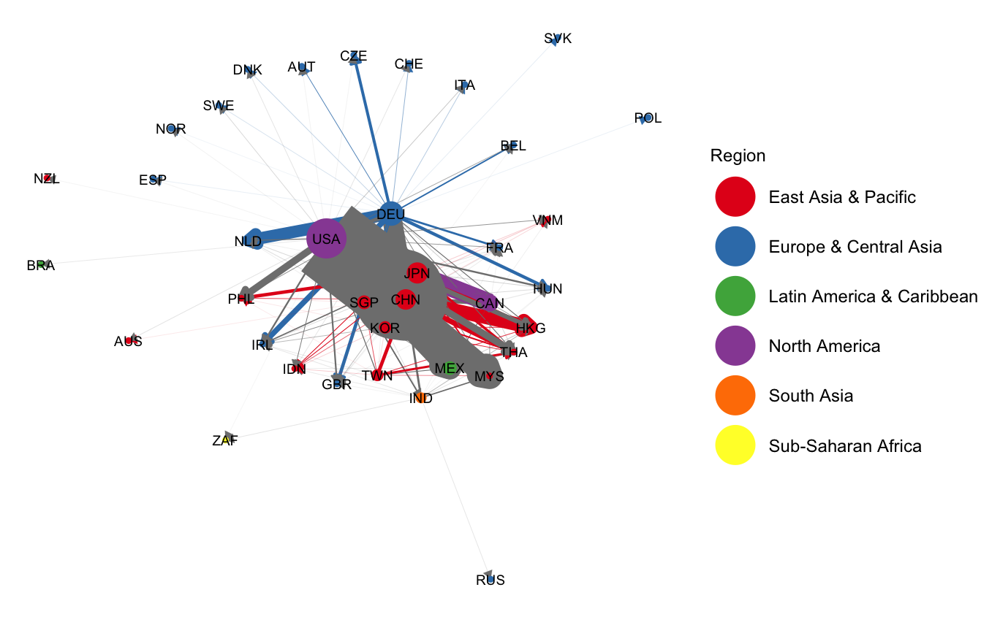
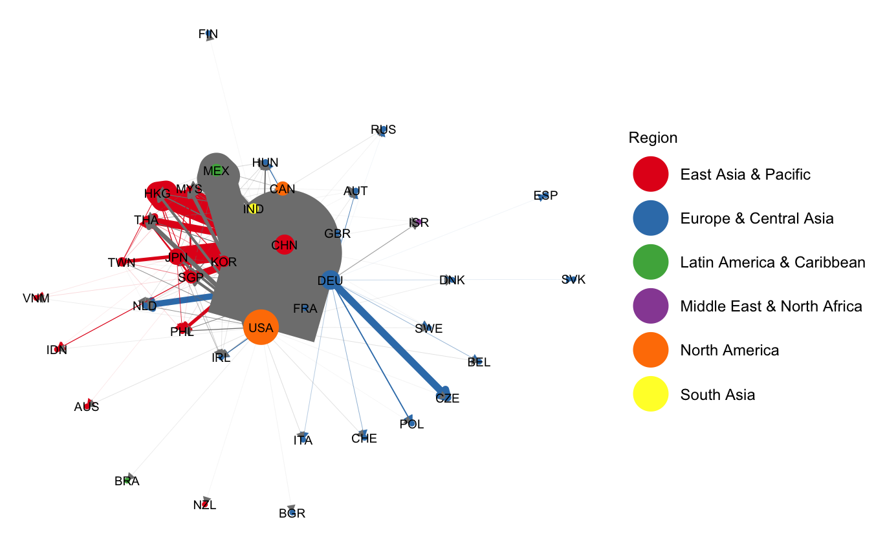

class: inverse, center, middle


```{r xaringanExtra, echo = FALSE}
  xaringanExtra::use_progress_bar(color = "teal", location = "bottom")
```

# Hello! 

### The plan changed, I was hoping to be in Taipei. 

--

### `r emo::ji("weary")` `r emo::ji("weary")` `r emo::ji("weary")`

--

### Hopefully, Google Meet and the internet will work out well.

--

`r emo::ji("pray")`
---

# For Today's Presentation, 

You can 

- <u>**visit**</u> [https://tinyurl.com/JEFFKUOTEA23](https://tinyurl.com/JEFFKUOTEA23)

--

- <u>**scan**</u> to view today's slides

<center>

</center>

--

- <u>**find**</u> more about my work -> <https://jeffjkuo.github.io>

- <u>**email**</u> to [jeffkuo@gwu.edu](jeffkuo@gwu.edu), for questions, comments, or updated WP

---
class: center, middle, inverse 

# Introduction

---

class: 

## Main Questions

- Could we identify the <u>process</u> of Taiwan building the world's PC manufacturing center?

--

- How do we measure the <u>role</u> of a country's industry in global trade?

  - **degree of centrality** in the trade network

--

- Could we demonstrate the <u>evolution</u> of the role by using International Trade Network analysis?

--

- Is Taiwan still in <u>center</u> of the global trade network now?

## Contributions

  - Develop an <u>algorithm</u> to analyze Taiwan's role in global trade network graphically.
    - It does <u>not</u> limit to PC industry; the algorithm potentially could expand to other industries. 
  
  - Graphically demonstrate the <u>evolution</u> of the centrality of the Taiwan-PC industry.
  
---
class: center, middle, inverse

# Context

---

## TSMC Global Operation
<center>

</center>

---

## Formation of Silicon Shield?

.pull-left[
.pull-left[
[**Silicon Shield**](https://www.amazon.sg/Silicon-Shield-Taiwans-Protection-Against/dp/1928704891)

(Addison, 2001)


Taiwan's Protection Against Chinese Attack

]

.pull-right[
**Why Taiwan Matters?** 

(Rigger, 2011)


Samll Island, Global Powerhouse


]]

.pull-right[
.pull-left[

Chip War 

(Miller, 2022)


The Fight for the World's Most Critical Technology
]

.pull-right[
[**World on the Brink**](https://www.amazon.com/)

(Alperovitch, 2024)

How America Can Beat China in the Race for 21st Centry
]]


---

class: inverse, center, middle

# Theory 

<figure>


</figure>
1996 <--- v.s. --->  2016 

"PC Relating Products Export Network"

---

# International Trade Network

- International trade data can be analyzed using a network perspective, where the network is a set of countries linked by weighted and directed trade ties. ([Serrano et al., 2009](https://www.pnas.org/doi/10.1073/pnas.0808904106))

--

- International Trade Network (ITN) has various name, aka
  
  - World Trade Web (WTW)
  
  - World Trade Network (WTN)

--

- To build up the network in the International Trade setting, we need some of the attributes. 
  
  - Region 
  - Income Level
  - GDP
  - GDP per capita 
  - GDP growth
  - FDI

---

# Network  

- M.O. Jackson (2008) - [Social and Economic Networks](https://web.stanford.edu/~jacksonm/books.html#book)

- Nodes and Players 

 - The set $N=\{1,...,n\}$ is the _nodes_ that are involved in a network of relationships.
 
 - Sometimes ones refer it "vertices," "individuals," "agents," or "players."
 
 - In the international trade network, the nodes we have here are "countries."
 
- ITN is a "directed" network 
  - A network is _directed_ if it is possible that $g_{ij} \neq g_{ji}$ for all nodes $i$ and $j$.
 
- Degree and Network Density
  - _Degree_ of a node is the number of links that the node gets involved, which is the cardinality of the node's neighborhood. The node i's degree in a network g, denoted $d_i(g)$, is $$d_i(g) = \# \{j: g_{ji}=1 \} = \# N_i(g)$$

  - _Network Density_: the relative fraction of links that are present, and is simply the average degree divided by $n-1$
---

# Network: centrality degree of nodes

- Why Centrality Matter?
  - It's an important trait for a node $i$ in network $g$
  
  - Measures of centrality can be categorized into four main groups depending on the types of statistics on which they are based. 

       1. Degree: how connected a node is. (**which we focus in this project**)
    
      2. Closeness: how easily a node can reach other nodes.
    
      3. Betweenness: how important a node is in terms of connecting other nodes.
      
      4. Neighbors' Characteristics: how important, central, or influential a node's neighbors are. 
      
- Other Network's Characteristics 
  
  - Degree Distribution: a description of the relative frequencies of nodes that have different degrees. 
  - Diameter: The largest distance between any two nodes in the network. 
  - Cliquishness, Cohesiveness, and Clustering
  
---
class: inverse, middle, center
background-image: url(worldbank.jpeg)
background-size: 70%
#Data

---

## Data Sources

For product level, Harmonized System's Product Code, there are two database we can use. 

- World International Trade Solution (WITS) - https://wits.worldbank.org/
 - Maintained by World Bank Group
 
  - WITS provides international merchandise trade, tariff and non-tariff measures (NTM) data. Browse the Country profile section to obtain countries exports, imports and tariff statistics along with relevant development data.
 
 - Taiwan's country code "Other Asia, nes"

- UN Comtrade Database - https://comtradeplus.un.org/

  - They provide the API service. So we choose this one for now. 
  
- Harmonized System (HS) Codes
  - International Trade Administration (ITS) - https://www.trade.gov/harmonized-system-hs-codes
  - HS system is a global product classification system. To export, the firms need to know the HS code for their products.

---

class: inverse, middle, center

# Methodology (Algorithm)
    
---

# Algorithm 

- The following steps show how we plot the International Trade Network diagram.

  1. Download the data from UN Comtrade database. 

  2. Find all the HS-code associated with "computer"
   
      - In the HS code system, it is called "data process machines" 
  
  3. Set up the time and periods that we would like to plot. 

  4. Deciding which side we are focusing on: "imports" or "exports." 
  5. Clean up the data due to the naming problem of "Taiwan" in the UN database. 
  
  6. Plot it in R.  

---

# Results

- Using the 1996, 2001, 2006, 2011, 2016's PC Industry's Network as an example. 
- 1996 is the starting point of the data. 

  
  
---

# Results (cont.)
- 2001
   
  

---

# Results (cont.)
- 2006
   
  

---

# Results (cont.)
- 2011
   
  

---

# Results (cont.)
- 2016
   
  


---

class: middle

## Conclusion

- We can draw two major conclusions by comparing the five-year network graphs. 

  1. From the plotted results, we found the "centrality" for the PC manufacturing industry; Taiwan moved toward the sphere, while China moved toward the center of the network. 
  
  2. Intra-continental trade (color linkages) reduces while inter-continental trade (grey linkages) increases.  
  
  3. Global networks are more dense. 

## Future Work

  1. Expand this to the other industries, and compare the PC industry to other industries in the trade liberalization era. 

    - So that maybe we can find another intangible "shield."

  2. Expand the current exercise to a macro-perspective, try to find out the _density of the network_ and the _degree of distribution_

  3. Connect the results to the dynamic Computational General Equilibrium model.
    
---
class: middle, center

# Thank You!
   
   [jeffkuo@gwu.edu](jeffkuo@gwu.edu)
   
   Call for co-authors!  
   
  

   This presentation is made by RMarkdown - [xaringan](https://github.com/yihui/xaringan) (Hsieh, 2016)


